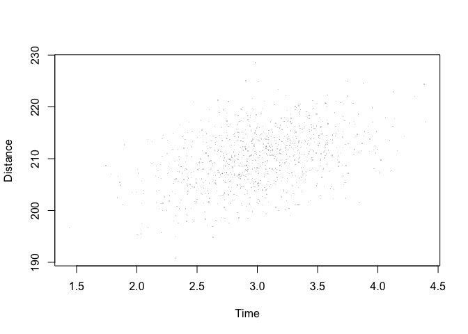
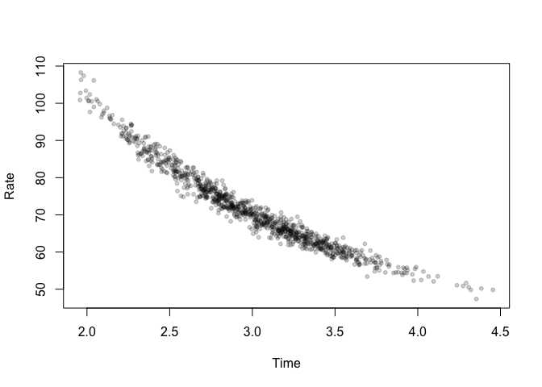
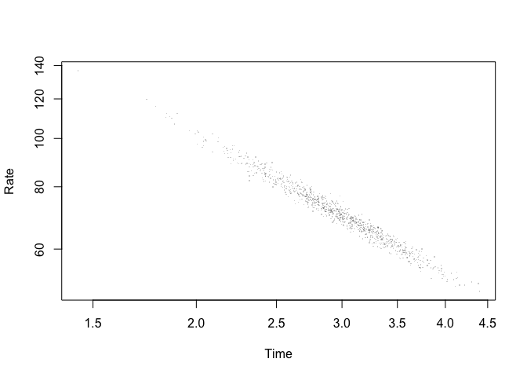

<!-- README.md is generated from README.Rmd. Please edit that file -->

# hyperr8

<!-- badges: start -->

[](https://github.com/bomeara/hyperr8/actions/workflows/R-CMD-check.yaml)
<!-- badges: end -->

The goal of hyperr8 is to properly handle datasets that have a rate
versus a time.

## Installation

You can install the development version of hyperr8 from
[GitHub](https://github.com/) with:

``` r
# install.packages("devtools")
devtools::install_github("bomeara/hyperr8")
```

## Example

This is a basic example which shows you how to solve a common problem:

``` r
library(hyperr8)
car_rates <- generate_car_simulation()
head(car_rates)
#>   distance     time     rate      citation
#> 1 210.2970 3.363070 62.53124 simulated_car
#> 2 214.3011 3.175702 67.48150 simulated_car
#> 3 218.7563 2.978665 73.44106 simulated_car
#> 4 202.7017 2.220715 91.27771 simulated_car
#> 5 204.1232 2.605153 78.35364 simulated_car
#> 6 209.4557 2.556441 81.93255 simulated_car
```

This generates a dataset with 1,000 cars with an average speed of 70 mph
and an average driving time of 3 hours, so an average distance traveled
of 210 miles. The driving time and distance traveled are highly
correlated (0.99). Just looking at the raw distance versus time, we see
a strong correlation:



But if we plot the estimated rate versus time, we see a hyperbola:



And this is even more clear on a log-log plot:


