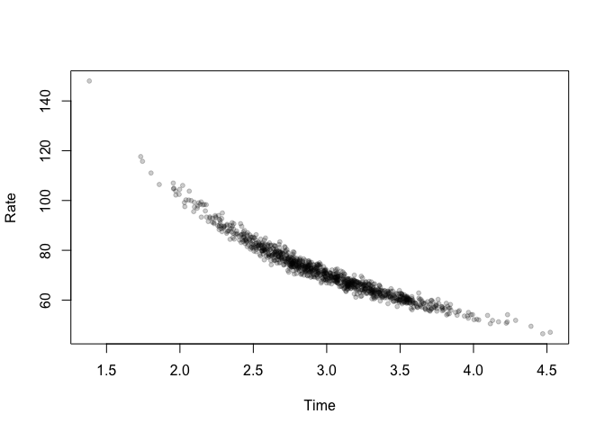

<!-- README.md is generated from README.Rmd. Please edit that file -->

# hyperr8

<!-- badges: start -->
<!-- badges: end -->

The goal of hyperr8 is to properly handle datasets that have a rate
versus a time.

## Installation

You can install the development version of hyperr8 from
[GitHub](https://github.com/) with:

``` r
# install.packages("devtools")
devtools::install_github("bomeara/hyperr8")
```

## Example

This is a basic example which shows you how to solve a common problem:

``` r
library(hyperr8)
car_rates <- generate_car_simulation()
head(car_rates)
#>   distance     time     rate       dataset
#> 1 206.9500 2.368772 87.36596 simulated car
#> 2 221.3413 3.661825 60.44562 simulated car
#> 3 208.6496 2.965327 70.36310 simulated car
#> 4 212.2328 3.012719 70.44559 simulated car
#> 5 214.2982 3.185374 67.27568 simulated car
#> 6 209.1510 3.231822 64.71612 simulated car
```

This generates a dataset with 1,000 cars with an average speed of 70 mph
and an average driving time of 3 hours, so an average distance traveled
of 210 miles. The driving time and distance traveled are highly
correlated (0.99). Just looking at the raw distance versus time, we see
a strong correlation:


But if we plot the estimated rate versus time, we see a hyperbola:



And this is even more clear on a log-log plot:


