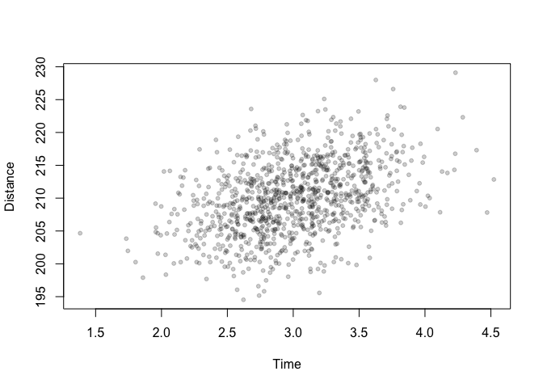
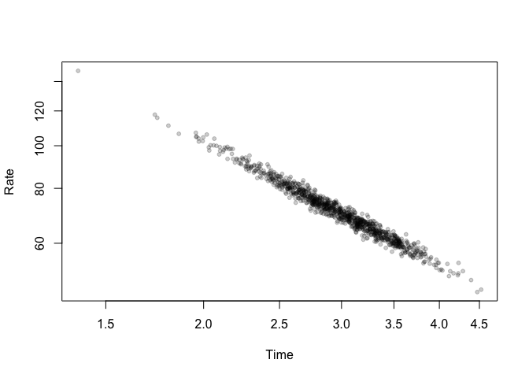

<!-- README.md is generated from README.Rmd. Please edit that file -->

# hyperr8

<!-- badges: start -->
<!-- badges: end -->

The goal of hyperr8 is to properly handle datasets that have a rate
versus a time.

## Installation

You can install the development version of hyperr8 from
[GitHub](https://github.com/) with:

``` r
# install.packages("devtools")
devtools::install_github("bomeara/hyperr8")
```

## Example

This is a basic example which shows you how to solve a common problem:

``` r
library(hyperr8)
car_rates <- generate_car_simulation()
head(car_rates)
#>   distance     time     rate       dataset
#> 1 211.1014 2.578783 81.86087 simulated car
#> 2 213.5445 3.352930 63.68891 simulated car
#> 3 209.1898 2.642042 79.17732 simulated car
#> 4 213.9877 2.962133 72.24110 simulated car
#> 5 209.4265 3.239187 64.65404 simulated car
#> 6 204.6919 2.532969 80.81105 simulated car
```

This generates a dataset with 1,000 cars with an average speed of 70 mph
and an average driving time of 3 hours, so an average distance traveled
of 210 miles. The driving time and distance traveled are highly
correlated (0.99). Just looking at the raw distance versus time, we see
a strong correlation:



But if we plot the estimated rate versus time, we see a hyperbola:


And this is even more clear on a log-log plot:


